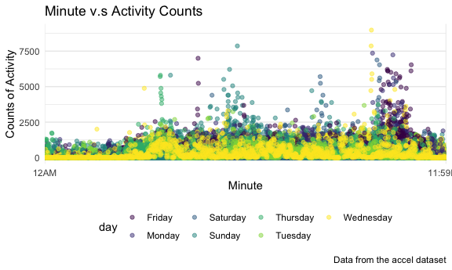

Visualization_Homework
================

``` r
library(tidyverse)
```

    ## ── Attaching packages ─────────────────────────────────────── tidyverse 1.3.2 ──
    ## ✔ ggplot2 3.3.6      ✔ purrr   0.3.4 
    ## ✔ tibble  3.1.8      ✔ dplyr   1.0.10
    ## ✔ tidyr   1.2.0      ✔ stringr 1.4.1 
    ## ✔ readr   2.1.2      ✔ forcats 0.5.2 
    ## ── Conflicts ────────────────────────────────────────── tidyverse_conflicts() ──
    ## ✖ dplyr::filter() masks stats::filter()
    ## ✖ dplyr::lag()    masks stats::lag()

``` r
library(patchwork)

knitr::opts_chunk$set(
  fig.width = 6,
  fig.asp = .6,
  out.width = "90%"
)

theme_set(theme_minimal() + theme(legend.position = "bottom"))

options(
  ggplot2.continuous.colour = "viridis",
  ggplot2.continuous.fill = "viridis"
)

scale_colour_discrete = scale_colour_viridis_d
scale_fill_discrete = scale_fill_viridis_d
```

## Problem 1

#### Load in data

There are 1384617 observations of 15 variables in total. It contains
order details from instacart such as order id, user id, order hour,
product name, product department e.t.c . There are 39123 distinct
products, 131209 order id and 131209 users id in the table.

``` r
library(p8105.datasets)
data("instacart")
```

``` r
instacart %>% 
  count(product_name)
```

    ## # A tibble: 39,123 × 2
    ##    product_name                                                                n
    ##    <chr>                                                                   <int>
    ##  1 "\\\"Constant Comment\\\" Black Tea"                                        3
    ##  2 "\\\"Constant Comment\\\" Decaffeinated Black Tea Blend"                    3
    ##  3 "\\\"Darn Good\\\" Chili Mix"                                               5
    ##  4 "\\\"Im Pei-nut Butter\\\" Double Chocolate Cookie & Peanut Butter Ice…     5
    ##  5 "\\\"Mies Vanilla Rohe\\\" Ice Cream Bars"                                  6
    ##  6 "\\\"Mokaccino\\\" Milk + Blue Bottle Coffee Chocolate"                    10
    ##  7 "& Go! Hazelnut Spread + Pretzel Sticks"                                   10
    ##  8 "#2 Coffee Filters"                                                        22
    ##  9 "#2 Cone White Coffee Filters"                                              1
    ## 10 "#2 Mechanical Pencils"                                                     1
    ## # … with 39,113 more rows

``` r
instacart %>% 
  count(user_id)
```

    ## # A tibble: 131,209 × 2
    ##    user_id     n
    ##      <int> <int>
    ##  1       1    11
    ##  2       2    31
    ##  3       5     9
    ##  4       7     9
    ##  5       8    18
    ##  6       9    22
    ##  7      10     4
    ##  8      13     5
    ##  9      14    11
    ## 10      17     6
    ## # … with 131,199 more rows

``` r
instacart %>% 
  count(order_id)
```

    ## # A tibble: 131,209 × 2
    ##    order_id     n
    ##       <int> <int>
    ##  1        1     8
    ##  2       36     8
    ##  3       38     9
    ##  4       96     7
    ##  5       98    49
    ##  6      112    11
    ##  7      170    17
    ##  8      218     5
    ##  9      226    13
    ## 10      349    11
    ## # … with 131,199 more rows

#### Number of aisles and most popular aisles.

There are 134 aisles. The top three popular aisles are fresh vegetables,
fresh fruits, packaged vegetables fruits.

``` r
instacart %>% 
  group_by(aisle) %>%
  summarize(n_obs = n()) %>% 
  arrange(desc(n_obs))
```

    ## # A tibble: 134 × 2
    ##    aisle                          n_obs
    ##    <chr>                          <int>
    ##  1 fresh vegetables              150609
    ##  2 fresh fruits                  150473
    ##  3 packaged vegetables fruits     78493
    ##  4 yogurt                         55240
    ##  5 packaged cheese                41699
    ##  6 water seltzer sparkling water  36617
    ##  7 milk                           32644
    ##  8 chips pretzels                 31269
    ##  9 soy lactosefree                26240
    ## 10 bread                          23635
    ## # … with 124 more rows

#### Plot showing the number of items ordered in each aisle

``` r
instacart %>% 
  group_by(aisle_id, aisle) %>%
  summarize(n_obs = n()) %>% 
  filter(n_obs > 10000) %>%
  ggplot(aes(x = aisle_id, y = n_obs, color = aisle)) +
  geom_point() +
  labs(
    title = "Aisles v.s Order number",
    x = "Aisle_id",
    y = "Number of items ordered"
  ) 
```

    ## `summarise()` has grouped output by 'aisle_id'. You can override using the
    ## `.groups` argument.


#### Table showing the three most popular items in each of the aisles “baking ingredients”, “dog food care”, and “packaged vegetables fruits”.

``` r
instacart %>% 
  group_by(aisle, product_name) %>% 
  summarize(n_obs = n()) %>% 
  filter(aisle == "baking ingredients" | aisle =="dog food care" |aisle == "packaged vegetables fruits") %>% 
  mutate(rank = min_rank(desc(n_obs))) %>% 
  filter(rank < 4)
```

    ## `summarise()` has grouped output by 'aisle'. You can override using the
    ## `.groups` argument.

    ## # A tibble: 9 × 4
    ## # Groups:   aisle [3]
    ##   aisle                      product_name                            n_obs  rank
    ##   <chr>                      <chr>                                   <int> <int>
    ## 1 baking ingredients         Cane Sugar                                336     3
    ## 2 baking ingredients         Light Brown Sugar                         499     1
    ## 3 baking ingredients         Pure Baking Soda                          387     2
    ## 4 dog food care              Organix Chicken & Brown Rice Recipe        28     2
    ## 5 dog food care              Small Dog Biscuits                         26     3
    ## 6 dog food care              Snack Sticks Chicken & Rice Recipe Dog…    30     1
    ## 7 packaged vegetables fruits Organic Baby Spinach                     9784     1
    ## 8 packaged vegetables fruits Organic Blueberries                      4966     3
    ## 9 packaged vegetables fruits Organic Raspberries                      5546     2

#### Table showing mean hour of the day at which Pink Lady Apples and Coffee Ice Cream are ordered on each day

``` r
instacart %>% 
    mutate(order_hour_of_day= as.integer(order_hour_of_day)) %>% 
    select(product_name, order_dow, order_hour_of_day) %>% 
    filter(product_name == "Pink Lady Apples" | product_name == "Coffee Ice Cream") %>% 
    group_by(product_name, order_dow) %>% 
    summarize(mean_order = mean(order_hour_of_day)) %>% 
    pivot_wider(
    names_from = order_dow,
    values_from = mean_order) 
```

    ## `summarise()` has grouped output by 'product_name'. You can override using the
    ## `.groups` argument.

    ## # A tibble: 2 × 8
    ## # Groups:   product_name [2]
    ##   product_name       `0`   `1`   `2`   `3`   `4`   `5`   `6`
    ##   <chr>            <dbl> <dbl> <dbl> <dbl> <dbl> <dbl> <dbl>
    ## 1 Coffee Ice Cream  13.8  14.3  15.4  15.3  15.2  12.3  13.8
    ## 2 Pink Lady Apples  13.4  11.4  11.7  14.2  11.6  12.8  11.9

## Problem 2

I cleaned the column names, created a column indicating “weekday” and
“weekend”, and perform pivot longer to “activity.” columns. Now I have 6
colunms - “week”, “day”, “day_id”, “day_of_week”, “hour”, “counts”.
There’s 50400 observations of 6 variables.

``` r
accel_df =
  read_csv("./data/accel_data.csv") %>% 
  janitor::clean_names() %>% 
  mutate(day_of_week = ifelse(day == "Saturday", "weekend", ifelse(day == "Sunday", "weekend", "weekday"))) %>% 
  pivot_longer(
    starts_with("activity"),
    names_to = "minute",
    values_to = "counts"
  )
```

    ## Rows: 35 Columns: 1443
    ## ── Column specification ────────────────────────────────────────────────────────
    ## Delimiter: ","
    ## chr    (1): day
    ## dbl (1442): week, day_id, activity.1, activity.2, activity.3, activity.4, ac...
    ## 
    ## ℹ Use `spec()` to retrieve the full column specification for this data.
    ## ℹ Specify the column types or set `show_col_types = FALSE` to quiet this message.

#### Total activity variable for each day

For week 1,2. There’s increasing trend of summation of activity counts
from Monday to Sunday.

``` r
accel_df %>% 
  group_by(week, day) %>% 
  summarize(sum = sum(counts)) %>% 
  arrange(week, sum)
```

    ## `summarise()` has grouped output by 'week'. You can override using the
    ## `.groups` argument.

    ## # A tibble: 35 × 3
    ## # Groups:   week [5]
    ##     week day           sum
    ##    <dbl> <chr>       <dbl>
    ##  1     1 Monday     78828.
    ##  2     1 Tuesday   307094.
    ##  3     1 Wednesday 340115.
    ##  4     1 Thursday  355924.
    ##  5     1 Saturday  376254 
    ##  6     1 Friday    480543.
    ##  7     1 Sunday    631105 
    ##  8     2 Monday    295431 
    ##  9     2 Sunday    422018 
    ## 10     2 Tuesday   423245 
    ## # … with 25 more rows

#### Graph presenting activity counts for each day

Trends of graph: Most of Wednesday’s and Tuesday’s activity counts are
low compared to counts on other days. There’s also trend of one week of
high counts followed by one week of low counts.

``` r
accel_df %>% 
  ggplot(aes(x = minute, y = counts, color = day)) +
  geom_point(alpha = 0.5) +
    labs(
    title = "Minute v.s Activity Counts",
    x = "Minute",
    y = "Counts of Activity"
  ) 
```



## Problem 3

Data load in and description

``` r
library(p8105.datasets)
data("ny_noaa")
```
